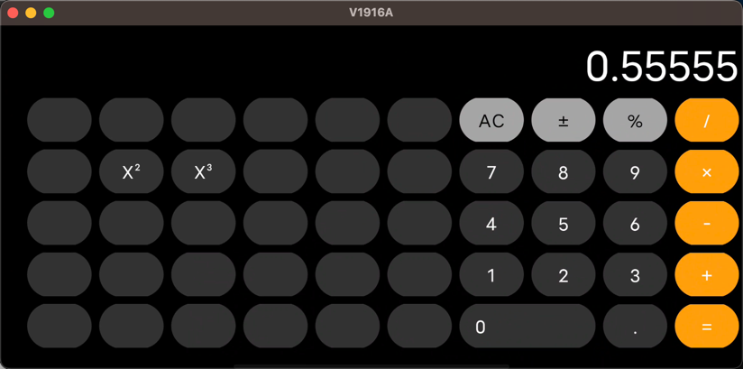

## 2022 Compose 进阶挑战作品

### 效果展示





### 设计思路

#### 横竖屏判断&效果

用`LaunchedEffect`来监听横竖屏变化来切换横竖屏UI

```kotlin
    val configuration = LocalConfiguration.current
var orientation by remember { mutableStateOf(configuration.orientation) }
LaunchedEffect(configuration) {
    orientation = configuration.orientation
}
```

用`com.google.accompanist:accompanist-systemuicontroller`来把状态栏设置成黑色，且横屏下隐藏状态栏

#### 计算器按钮逻辑

在`Operation.kt`中抽象了计算器按钮的输入逻辑
分为
输入操作符`InputOperation`，如1、2、3等
比如0 当当前值已经是0的时候，直接返回0，否则拼一个0
```kotlin
val ZERO = InputOperation("0") { input ->
    if (input == "0") {
        return@InputOperation input
    }
    return@InputOperation input + "0"
}
```
直接计算结果操作符`ImmediateCalculateOperation`，如-,%、X²、X³等
比如 - ，直接把输入值取反
```kotlin
val NEGATIVE = ImmediateCalculateOperation("±") { num ->
    return@ImmediateCalculateOperation num.negate()
}
```
数学计算操作符`MathCalculateOperation`，如+、-、x、/等
比如+，返回两个输入值的和
```kotlin
val PLUS = MathCalculateOperation("+") { input1, input2 ->
    return@MathCalculateOperation input1 + input2
}
```
统一定义了每个操作符（按钮）的入参和出参方式

#### 计算器按钮UI定义

抽象按钮UI，每个按钮对应一个UI

```kotlin
data class ButtonUiModel(
    val textColor: Color,
    val textAlign: Alignment.Horizontal = Alignment.CenterHorizontally,
    val backgroundColor: Color,
    val disabledBackGroundColor: Color? = null,
    val pressedColor: Color,
    val selectedColor: Color? = null,
    val enabled: Boolean = true,
    val weight: Int = 1,
)
```

#### 计算逻辑

在`CalculatorViewModel`中定义所有的计算逻辑，定义竖屏所有按钮`portraitButtonItems`和横屏所有按钮`landscapeButtonItems`
其他都是正常计算器逻辑

#### UI设计

计算器按钮部分使用`LazyVerticalGrid`实现，这样做的原因是，不管横竖屏，只要传入对应的抽象定义和列数就可以，不需要额外做判断